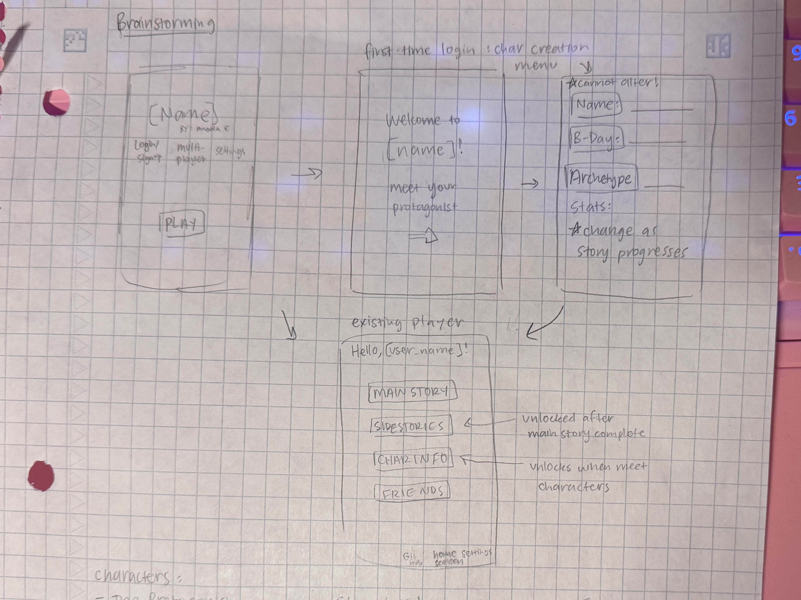
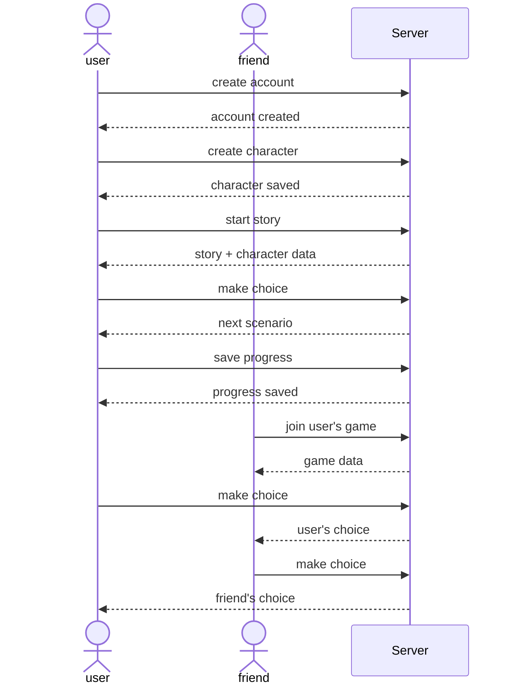

# startup

Divergent Threads is an interactive but simple visual novel where users can create their own characters and experience stories based on their choices and character statistics. Users can customise their character, play through different scenarios and reach alternate endings, save their progress, and eventually join friends in shared story experiences.

### Elevator Pitch

Imagine being able to create your own protagonist and experience life as the main character. Divergent Threads is an interactive storytelling application where users create customisable characters and play through scenarios where their choices, morals, and stats alter the story. Players will be able to explore different outcomes, save their progress, and invite friends into shared games where everyone's decisions influence the same story. Instead of just sitting back watching a show, this game lets you become part of the story.

### Design

Here is a sequence diagram that shows how people would interact with the backend to make shared story choices.

### Key features
- secure login over HTTPS
- simple character customisation
- display of story choices
- ability to select choice
- users can save their progress
- users can choose which story chapters to play (progress is saved)

### Technologies
I will use the required technologies as follows:
- **HTML** : use HTML structure for login page, character creation, story pages, and game interface
- **CSS** : for styling the application, making sure it looks consistent for different screen sizes, uses appropriate amount of whitespace, and colour choice/contrast.
- **React** : used for login, character creation choices
- **Service** : provide backend service with endpoints for:
    - registering and logging in users
    - creating and retrieving characters
    - retrieving stories and chapters
    - submitting story choices
    - saving and retrieving game progress
    - creating and joining multiplayer games
    - third party API: https://www.7timer.info/doc.php?lang=en for game menu screen, uses user location to change page background according to weather.
- **DB/Login** : store user data and choices in MongoDB (character stats, login details, story choices)
- **WebSocket** : allow players in same game to receive real-time updates when another player makes a choice or when the shared story changes

## Specification Deliverable
For this deliverable I did the following.
- [x] I completed the prerequisites for this deliverable (Git commit requirement)
- [x] Proper use of Markdown
- [x] A concise and compelling elevator pitch
- [x] Description of key features
- [x] Description of how you will use each technology
- [x] One or more rough sketches of your application. Images must be embedded in this file using Markdown image references.

## 🚀 AWS deliverable

For this deliverable I did the following. I checked the box `[x]` and added a description for things I completed.

- [x] **Rented EC2 server** - Got a t3.nano.
- [x] **Leased domain name** - webprogramming260.click
- [x] **Server accessible** from my domain: [https://startup.webprogramming260.click](https://startup.webprogramming260.click)

## HTML deliverable

For this deliverable I built out the structure of my application using HTML.

- [x] I completed the prerequisites for this deliverable (Simon deployed, GitHub link, Git commits)
- [x] **HTML pages** - Four HTML pages: loading screen, login page, character creation, and main menu
- [x] **Proper HTML element usage** - used HTML tags
- [x] **Links** - loading screen --> login --> character creation --> main menu (links back to all pages).
- [x] **Text** - text describing where things will go and what each section is for.
- [x] **3rd party API placeholder** - Placeholder for calls to 7timer.
- [x] **Images** - added placeholder for character image
- [x] **DB/Login** - Input box and submit button for login and signup.
- [x] **WebSocket** - text describing where realtime communication will go (friends/multiplayer section).